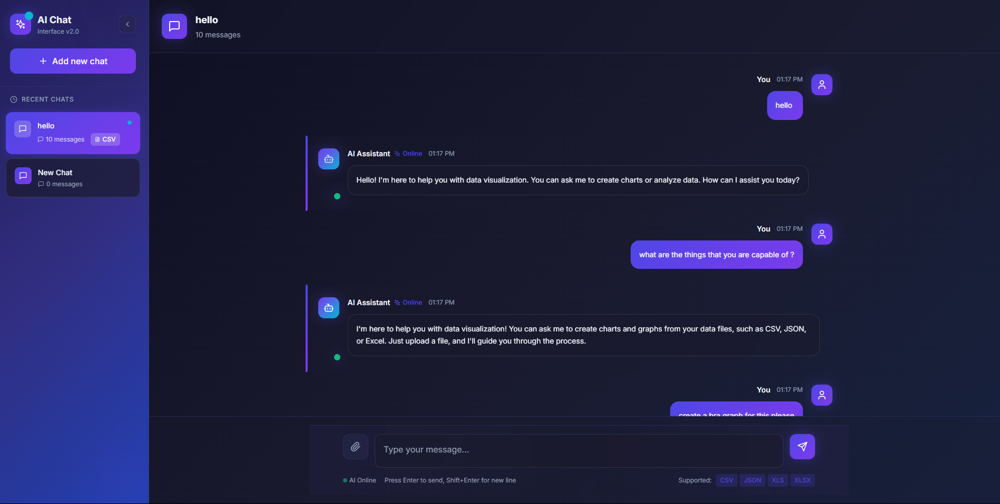
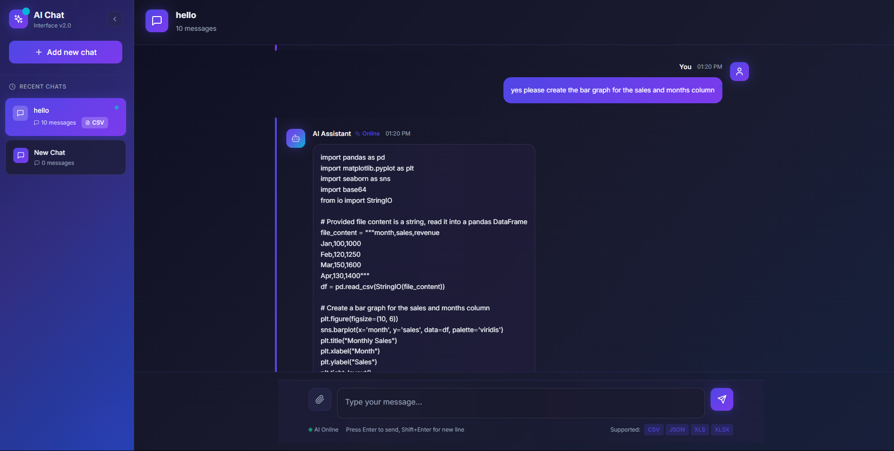
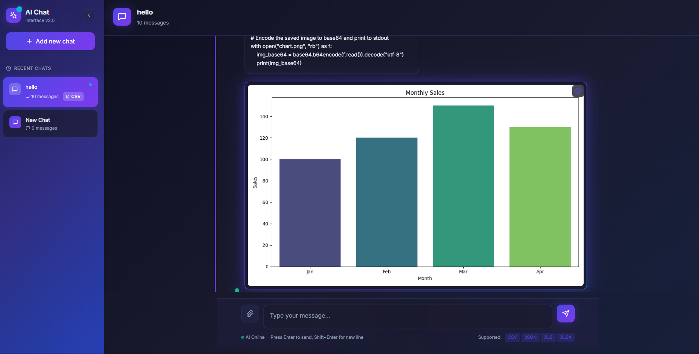

# AI-Powered Data Visualization Assistant

This interactive application empowers you to generate insightful charts from your data simply by having a conversation. Upload your data file, and our AI assistant will guide you through the process of creating beautiful visualizations.

## Watch It in Action

Check out this short video demonstrating a full conversation, from uploading a file to generating a chart:

## Key Features

- **Conversational Interface:** Just chat with the AI. No complex menus or code required. Ask for charts in plain English.
- **File Uploads:** Supports CSV, JSON, and Excel data files.
- **Intelligent Clarification:** If your request is ambiguous, the assistant will ask follow-up questions to ensure the chart is exactly what you want.
- **Context-Aware:** The assistant remembers the file you've uploaded and the conversation history, leading to a smooth and natural workflow.
- **Handles General Chat:** More than just a tool, you can have a friendly conversation with the assistant.

## How It Works

### 1. Start the Conversation
Simply greet the assistant or upload your data file to begin.

### 2. The AI Generates Code
Based on your request, the assistant determines the right chart and writes the Python code to generate it.

### 3. Your Chart is Ready
The assistant executes the code and displays the final chart directly in the chat.

## Tech Stack

This project is brought to life using a modern and powerful set of technologies:

### Frontend
- **React** & **Next.js**: For a fast and dynamic user interface.
- **TypeScript**: For robust, type-safe code.
- **Tailwind CSS**: for beautiful, modern styling.

### Backend
- **Python** & **FastAPI**: For a high-performance, scalable API.
- **LangChain** & **LangGraph**: To create and manage the conversational AI agent's logic and state.
- **OpenAI API (gpt-4o)**: Powers the natural language understanding and generation.
- **E2B Code Interpreter**: To safely execute the Python code for generating charts in a sandboxed environment. 